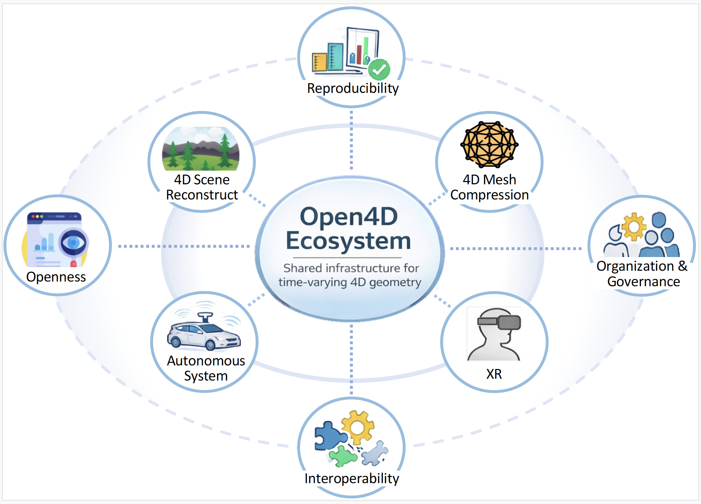

# Open4D

**Open4D** is an open, research-driven platform for the representation, compression, processing, evaluation, and streaming of
time-varying 4D geometry data. It is designed as shared infrastructure for application domains such as **XR systems, robotics,
teleoperation, digital twins, and autonomous systems**, where geometry evolves and varies
over time and must be processed under tight latency, bandwidth, and accuracy constraints.

---

## Ecosystem Overview

<p align="center">
  
</p>

**Open4D ecosystem layers:**
- **Core (`open4d/`)**: canonical 4D data models, IO, metrics
- **Modules (`modules/`)**: research algorithms (e.g., TVMC, ARAP-based tracking)
- **Benchmarks (`benchmarks/`)**: paper-reproducible evaluations
- **Apps (`apps/`)**: end-to-end pipelines and demos
- **Bindings (`cpp/`, `python/`)**: performance-critical + research-friendly APIs

---


## Why Open4D?

Today, 4D geometry pipelines are fragmented:
- algorithms live in paper-specific codebases,
- evaluation scripts are ad hoc,
- datasets and metrics are inconsistent,
- systems integration is repeatedly re-implemented.

Open4D provides a **common substrate**:
- stable 4D data abstractions,
- reusable IO and metrics,
- modular research algorithms,
- reproducible benchmarks,
- end-to-end system pipelines.

The goal is to let research **compound**, not reset with every paper.

---

## Repository Structure

```
Open4D/
├── open4d/ # Core public API (stable)
│ ├── core/ # 4D data structures
│ ├── io/ # Readers / writers
│ ├── metrics/ # Quality + temporal metrics
│ └── utils/
├── modules/ # Research systems and algorithms
│ ├── tvmc/
│ ├── arap_volume_tracking/
│ └── tvm_editing/
├── benchmarks/ # Reproducible experiments
├── apps/ # End-to-end pipelines
├── examples/ # Minimal usage examples
├── cpp/ # C++ core + bindings
├── tests/ # Unit + integration tests
├── docs/ # Documentation and figures
└── docker/ # Reproducible environments
```

---

## Design Principles

- **4D-first**: time is a first-class signal, not an afterthought
- **Separation of concerns**: core abstractions vs. research modules
- **Reproducibility**: benchmarks are explicit and scriptable
- **Systems-aware**: metrics include bitrate, latency, and temporal stability
- **Cross-domain**: XR, robotics, and autonomy share the same foundations

---

## Current Modules

- **TVMC** — Time-Varying Mesh Compression  
- **ARAP Volume Tracking** — deformation-aware temporal alignment  
- **Temporal Mesh Editing** — structured editing of dynamic geometry  

(Additional modules are expected to evolve independently on top of the core API.)

---

## Installation (Development)

```bash
git clone https://github.com/open4d/open4d.git
cd Open4D
pip install -e .
```

## Citation

If you use Open4D in academic work, please cite the project:

```bibtex
@software{open4d,
  title  = {Open4D: An Open-Source Library for 4D Geometry Processing},
  author = {Chen, Guodong and Dasari, Mallesham},
  year   = {2025}
} 
```

## Contributors

Core contributors:
- **Jason Balayev (balayev.j@northeastern.edu)**
- **Guodong Chen (chen.guod@northeastern.edu)**
- **Mallesham Dasari (m.dasari@northeastern.edu)**

Contributions from the broader research and open-source community are welcome.

## Contributing

Open4D is an open research platform. Contributions are welcome in the form of:
- new modules
- benchmarks and datasets
- metrics
- documentation
- performance improvements

Please reach out if you'd like to contribute!

